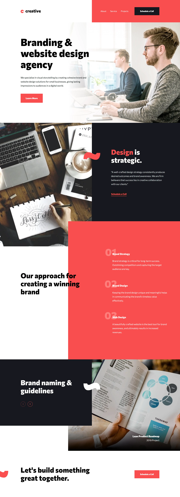

# Frontend Mentor - Creative Agency Single Page Website

A modern, responsive single-page website for a creative agency built with Next.js, React, and TypeScript. This project showcases a branding and website design agency's services with an interactive and visually appealing interface.

- Frontend Mentor Challenge URL: [Creative Agency Single Page Site](https://www.frontendmentor.io/challenges/creative-agency-singlepage-site-Pq6V3I2RM)
- Live Site URL: https://kerem-gurbuz-fm-creative-single-page-site.vercel.app

## Table of contents

- [Overview](#overview)
  - [The challenge](#the-challenge)
  - [Screenshot](#screenshot)
  - [Features](#features)
- [My process](#my-process)
  - [Built with](#built-with)
  - [Project Structure](#project-structure)
  - [What I learned](#what-i-learned)
  - [Useful resources](#useful-resources)
- [Author](#author)
- [Acknowledgments](#acknowledgments)

## Overview

### The challenge

Users should be able to:

- View the optimal layout for the site depending on their device's screen size
- See hover states for all interactive elements on the page
- Navigate the slider using either their mouse/trackpad or keyboard

### Screenshot



<table>
  <tr>
    <td align="center">Tablet-1</td>
    <td align="center">Tablet-2</td>
  </tr>
  <tr>
    <td></td>
    <td></td>
  </tr>
</table>

<table>
  <tr>
    <td align="center">Mobile-1</td>
    <td align="center">Mobile-2</td>
    <td align="center">Mobile-3</td>
    <td align="center">Mobile-4</td>
  </tr>
  <tr>
    <td></td>
    <td></td>
    <td></td>
    <td></td>
  </tr>
</table>

### Features

- Responsive design optimized for all screen sizes
- Interactive carousel for portfolio showcase
- Mobile-friendly navigation with hamburger menu
- Smooth animations and transitions
- SEO optimization with Next.js
- Type-safe development with TypeScript

## My process

### Built with

- [Next.js v15](https://nextjs.org/) - A React framework that provides server-side rendering and other advanced features for building modern web applications.
- [Tailwind CSS](https://tailwindcss.com/) - A utility-first CSS framework that allows you to rapidly build custom user interfaces.
- [shadcn/ui](https://ui.shadcn.com/) - A collection of reusable UI components built with Tailwind CSS, providing a consistent and visually appealing user interface.
- [Zod](https://zod.dev/) - A TypeScript-first schema validation library that helps ensure data integrity and type safety.

### Project Structure

```
src/
├── app/                              # Next.js app directory
│   ├── error.tsx                     # Error page component
│   ├── favicon.ico                   # Favicon
│   ├── global-error.tsx              # Global error handling
│   ├── layout.tsx                    # App layout
│   ├── manifest.ts                   # Web manifest
│   ├── not-found.tsx                 # 404 page
│   ├── page.tsx                      # Home page
│   ├── robots.ts                     # Robots.txt
│   └── sitemap.ts                    # Sitemap
├── components/                       # Reusable components
│   ├── common/                       # Shared components
│   │   ├── patterns/                 # Reusable patterns
│   │   ├── dynamic-image.tsx         # Dynamic image component
│   │   └── responsive-image.tsx      # Responsive image component
│   ├── layout/                       # Layout components
│   │   ├── header/                   # Header-related components
│   │   │   ├── mobile-menu/          # Mobile menu components
│   │   │   ├── index.tsx             # Header component
│   │   │   └── navigation.tsx        # Header navigation
│   │   └── index.ts                  # Layout components index
│   ├── sections/                     # Page sections
│   │   └── home/                     # Home page sections
│   │       ├── approach-section/     # Approach section components
│   │       ├── cta-section/          # Call-to-action section
│   │       ├── hero-section/         # Hero section
│   │       ├── portfolio-section/    # Portfolio section
│   │       ├── strategy-section/     # Strategy section
│   │       └── index.ts              # Home sections index
│   └── ui/                           # UI components
│       ├── button.tsx                # Button component
│       ├── carousel.tsx              # Carousel component
│       └── dropdown-menu.tsx         # Dropdown menu component
├── config/                           # Configuration files
│   ├── navigation/                   # Navigation configuration
│   │   ├── header.ts                 # Header navigation
│   │   └── index.ts                  # Navigation configuration index
│   ├── seo/                          # SEO configuration
│   │   ├── metadata/                 # SEO metadata
│   │   └── schema/                   # SEO schema
│   ├── env.ts                        # Environment variables
│   └── routes.ts                     # Application routes
└── lib/                              # Utilities and helpers
    ├── styles/                       # Global styles
    │   ├── fonts.ts                  # Font configuration
    │   └── globals.css               # Global CSS
    ├── types/                        # Shared types
    │   ├── image-config.ts           # Image configuration types
    │   └── index.ts                  # Types index
    └── utils/                        # Utility functions
        ├── cn.ts                     # Tailwind CSS utility class names
        └── index.ts                  # Utility functions index
```

### What I learned

- **Next.js App Router**: Implemented modern routing patterns and page organization using the Next.js 15+ app directory structure
- **Type Safety**: Enhanced code reliability using TypeScript throughout the project
- **Component Architecture**: Developed a scalable component structure separating concerns between common, layout, and page-specific components
- **SEO Optimization**: Implemented comprehensive JSON-LD schemas and metadata for better search engine visibility

### Useful resources

- [Next.js Documentation](https://nextjs.org/docs) - Comprehensive guide for Next.js features
- [Tailwind CSS Documentation](https://tailwindcss.com/docs) - Detailed reference for Tailwind utilities
- [shadcn/ui Components](https://ui.shadcn.com/) - Re-usable component documentation
- [Zod Documentation](https://zod.dev/) - Schema validation reference

## Author

- LinkedIn - [Kerem Gurbuz](https://www.linkedin.com/in/gurbuz-kerem)
- Frontend Mentor - [@kerem-gurbuz](https://www.frontendmentor.io/profile/kerem-gurbuz)

## Acknowledgments

- Design inspiration from Frontend Mentor
- The Next.js team for their excellent documentation and examples
- [shadcn](https://twitter.com/shadcn) for the amazing UI components
